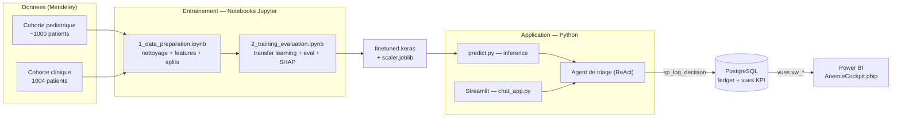
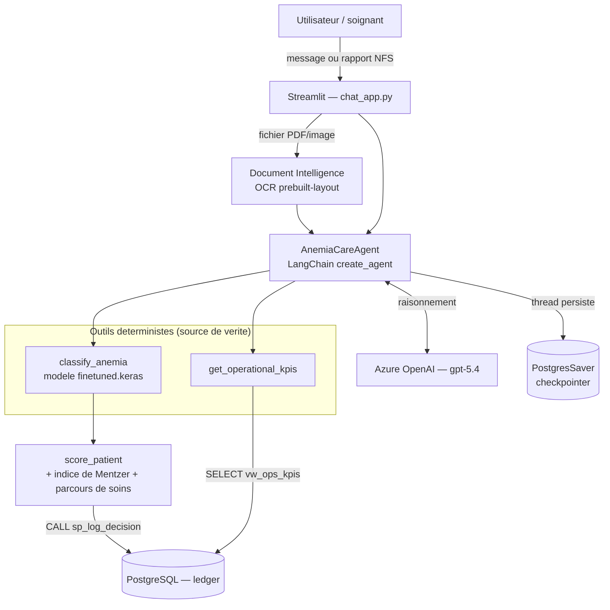
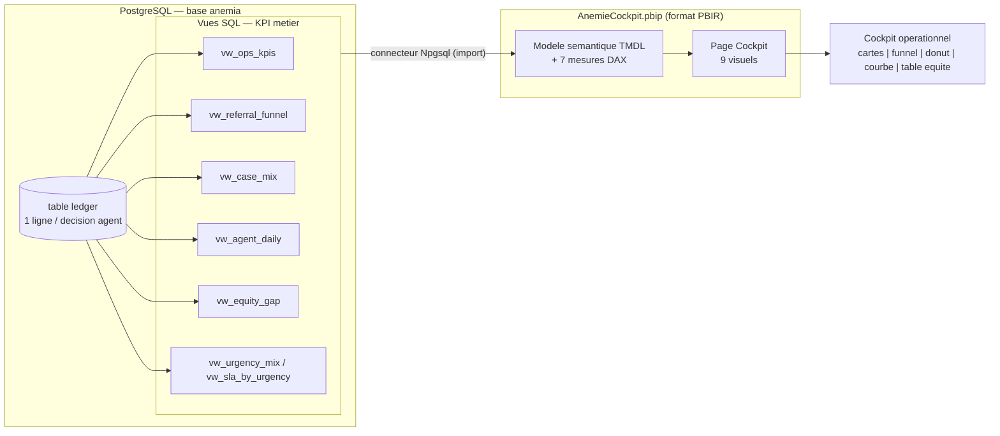

# Architecture — SmartHealth IA & BI (diagrammes)

> Diagrammes Mermaid. Pour les exporter en image (PNG/SVG) pour le rapport :
>
> - **VS Code** : ouvrir l'aperçu Markdown (Ctrl+Shift+V) → clic droit sur le diagramme → _Copy Image_, ou
> - **mermaid.live** : coller le bloc `mermaid` → _Actions → PNG/SVG_.

## 1. Architecture globale & stack technique

**Stack :** Python 3.13 · TensorFlow/Keras (MLP transfer learning) · scikit-learn ·
LangChain + LangGraph (agent ReAct + memoire) · Azure OpenAI (gpt-5.4) ·
Azure AI Document Intelligence (OCR) · PostgreSQL 18 (psycopg) · Streamlit (UI) ·
Power BI (PBIR / connecteur Npgsql).

## 2. Architecture de l'agent (ReAct)

**Principe :** le LLM RAISONNE et choisit les outils ; il n'invente aucun diagnostic.
Les outils cliniques sont deterministes (modele + regles) et journalisent chaque
decision dans PostgreSQL via une procedure stockee.

## 3. Architecture BI (Power BI ↔ PostgreSQL)

**Flux :** l'agent ecrit dans `ledger` → les vues `vw_*` recalculent les KPI en
direct → Power BI les importe via le connecteur PostgreSQL natif (aucun CSV
intermediaire) → rafraichir dans Power BI met a jour le tableau de bord.
